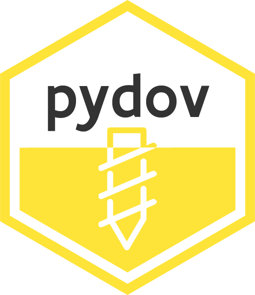

# pydov 

   

pydov is a Python package to query and download data from [Databank Ondergrond Vlaanderen (DOV)](https://www.dov.vlaanderen.be). It is hosted on [GitHub](https://github.com/DOV-Vlaanderen/pydov) and development is coordinated by Databank Ondergrond Vlaanderen (DOV). DOV aggregates data about soil, subsoil and groundwater of Flanders and makes them publicly available. Interactive and human-readable extraction and querying of the data is provided by a [web application](https://www.dov.vlaanderen.be/portaal/?module=verkenner#ModulePage), whereas the focus of this package is to **support machine-based extraction and conversion of the data**.

To get started, see the documentation at https://pydov.readthedocs.io.

Please note that downloading DOV data with pydov is governed by the same [disclaimer](https://www.dov.vlaanderen.be/page/disclaimer) that applies to the other DOV services. Be sure to consult it when using DOV data with pydov.

## Meta

- We welcome [contributions](.github/CONTRIBUTING.rst) including bug reports.
- License: MIT
- Please note that this project is released with a [Contributor Code of Conduct](.github/CODE_OF_CONDUCT.rst). By participating in this project you agree to abide by its terms.
