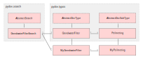

.. _output_df_fields:

=======================
Customizing data output
=======================

When using pydov to search datasets, the returned dataframe has different default columns (fields) depending on the dataset. We believe each dataframe to contain the most relevant fields for the corresponding dataset, but pydov allows you to select and customize the fields you want to be returned in the output dataframe.

Using return fields
*******************

Next to the `query` and `location` parameters, you can use the ``return_fields`` parameter of the `search` method to limit the columns in the dataframe and/or specify extra columns not included by default. The `return_fields` parameter takes a list of field names, which can be any combination of the available fields for the dataset you're searching.

For example, to query the boreholes in Ghent but only retrieve their depth, you'd use::

  from pydov.search.boring import BoringSearch

  bs = BoringSearch()
  df = bs.search(
      query=PropertyIsEqualTo('gemeente', 'Gent'),
      return_fields=('pkey_boring', 'diepte_boring_tot')
  )

Note that you can not only use ``return_fields`` to limit the columns from the default dataframe, but you can also add extra fields not included in this default set. The following example returns the purpose ('doel') of all the Ghent boreholes::

  from pydov.search.boring import BoringSearch

  bs = BoringSearch()
  df = bs.search(
    query=PropertyIsEqualTo('gemeente', 'Gent'),
    return_fields=('pkey_boring', 'doel')
  )

You can get an overview of the available fields for a dataset using its search objects `get_fields` method. More information can be found in the :ref:`available_attribute_fields` section.

.. note::

    Significant performance gains can be achieved by only including the fields you need, and more specifically by including only fields with a cost of 1. More information can be found in the :ref:`performance` section below.

    For instance, in the examples above only fields with a cost of 1 are selected, allowing the results to be retrieved almost instantly. By selecting only fields available in the WFS service (i.e. fields with a cost of 1), pydov only needs to query the WFS service to obtain the results and doesn't need to download any additional XML documents.

Including geometries
********************

By default, pydov will only include attribute fields in the output dataframe. However it is possible to add the geometry too, when requested in the ``return_fields`` parameter and additional support for geometries has been installed (see :ref:`installation`).

Finding geometry columns
  When pydov is installed with additional support for geometries, geometry column(s) are listed in the output of the ``get_fields()`` method. You can recognise them from their 'type', which is 'geometry'::

    from pydov.search.boring import BoringSearch

    bs = BoringSearch()
    print([f for f in bs.get_fields().values() if f['type'] == 'geometry'])

    [{'name': 'geom', 'definition': None, 'type': 'geometry', 'notnull': False, 'query': False, 'cost': 1}]

Default coordinate reference system
  When adding the geometry field as return field, you will get the corresponding geometry in the default coordinate reference system (CRS) of the layer - most of our layers use the Belgian Lambert 72 CRS (EPSG:31370) by default::

    df = bs.search(
        return_fields=['pkey_boring', 'geom'],
        max_features=1
    )
    print(df)

                                              pkey_boring                  geom
    0  https://www.dov.vlaanderen.be/data/boring/2016...  POINT (92424 170752)

Custom coordinate reference systems
  To get the geometry in another CRS, instead of adding just the fieldname as return field, you can add an instance of :class:`pydov.types.fields.GeometryReturnField` specifying both the field name and the desired CRS. If you'd like to receive the geometries in GPS coordinates (lon/lat, or EPSG:4326) instead of Belgian Lambert 72, you could::

      from pydov.types.fields import GeometryReturnField

      df = bs.search(
          return_fields=['pkey_boring', GeometryReturnField('geom', epsg=4326)],
          max_features=1
      )
      print(df)

                                            pkey_boring                    geom
    0  https://www.dov.vlaanderen.be/data/boring/2016...  POINT (3.5512 50.8443)

Turning the result into a GeoPandas GeoDataFrame
  pydov result dataframes which include a geometry column can easily be transformed from a normal Pandas DataFrame into a GeoPandas GeoDataFrame for further (geo) analysis, exporting or use in a new query using a :class:`pydov.util.location.GeopandasFilter`::

      bs = BoringSearch()
      df = bs.search(
          return_fields=['pkey_boring', GeometryReturnField('geom', 4326)],
          max_features=1
      )

      geo_df = GeoDataFrame(df, geometry='geom', crs='EPSG:4326')
      geo_df.to_file('boringen.geojson')

Defining custom object types
****************************

Should you want to make the returned dataframe fields more permanent or, more importantly, add extra XML fields to an existing object type, you can define your own object types and subtypes.

pydov works internally with *search classes* (in pydov.search) and object *types* and *subtypes* (in pydov.types). The former are derived from :class:`pydov.search.abstract.AbstractSearch` and define the WFS services to be queried while the latter define which fields to retrieve from the WFS and XML services for inclusion in the resulting dataframe.

An object main type (derived from :class:`pydov.types.abstract.AbstractDovType`, f.ex. GrondwaterFilter) can contain fields from both the WFS service as well as from the XML document, noting that there will be a single instance of the main type per WFS record. On the contrary, an object subtype (derived from :class:`pydov.types.abstract.AbstractDovSubType`, f.ex. Peilmeting) can list only fields from the XML document and can have a many-to-one relation with the main type: i.e. there can be multiple instances of the subtype for a given instance of the main type (f.ex. a single GrondwaterFilter can have multiple Peilmetingen). In the resulting output both will be combined in a single, flattened, dataframe whereby there will be as many rows as instances from the subtype, repeating the values of the main type for each one.

   UML schema of search classes, object types and subtypes

Search classes and object types are loosely coupled, each search class being linked to the default object type of the corresponding DOV object, allowing users to retrieve the default dataframe output when performing a search. However, to enable advanced customization of dataframe output columns at runtime, pydov allows for specifying an alternative object type upon creating an instance of the search classes. This system of 'pluggable types' enables users to extend the default type or subtype fields, or in fact rewrite them completely for their use-case.

The three most common reasons to define custom types are listed below: adding an extra XML field to a main type, a subtype or defining a new custom subtype altogether.

Adding an XML field to a main type
----------------------------------

To add an extra XML field to an existing main type, you have to create a subclass and extend the base type's fields.

To extend the field list of the basetype, use its ``extend_fields`` class method, allowing the base object type to be unaffected by your changes. It takes a new list as its argument, containing the fields to be added. These should all be instances of :class:`pydov.types.fields.XmlField`. While it is possible to add instances of :class:`pydov.types.fields.WfsField` as well, this is generally not necessary as those can be used in the return_fields argument without being explicitly defined in the object type.

For example, to add the field 'methode_xy' to the Boring datatype, you'd write::

  from pydov.search.boring import BoringSearch
  from pydov.types.boring import Boring
  from pydov.types.fields import XmlField

  class MyBoring(Boring):
      fields = Boring.extend_fields([
          XmlField(name='methode_xy',
                   source_xpath='/boring/xy/methode_opmeten',
                   datatype='string')
      ])

  bs = BoringSearch(objecttype=MyBoring)
  df = bs.search(query=PropertyIsEqualTo('gemeente', 'Gent'))

Adding an XML field to a subtype
--------------------------------

To add an extra XML field to an existing subtype, you have to create a subclass of the subtype and extend its fields. You also have to subclass the main type in order to register your new subtype.

To extend the field list of the subtype, use its ``extend_fields`` class method, allowing the base subtype to be unaffected by your changes. It takes a new list as its argument, containing the fields to be added. These should all be instances of :class:`pydov.types.fields.XmlField`. The source_xpath will be interpreted relative to the base subtypes rootpath.

To register your new subtype in a custom main type, subclass the existing main type and overwrite its ``subtypes`` field with a new list containing your new subtype.

For example, to add the field 'opmeter' to the Peilmeting subtype, you'd write::

  from pydov.search.grondwaterfilter import GrondwaterFilterSearch
  from pydov.types.grondwaterfilter import GrondwaterFilter, Peilmeting
  from pydov.types.fields import XmlField

  class MyPeilmeting(Peilmeting):
      fields = Peilmeting.extend_fields([
          XmlField(name='opmeter',
                   source_xpath='/opmeter/naam',
                   datatype='string')
      ])

  class MyGrondwaterFilter(GrondwaterFilter):
      subtypes = [MyPeilmeting]

  fs = GrondwaterFilterSearch(objecttype=MyGrondwaterFilter)
  df = fs.search(query=PropertyIsEqualTo('gemeente', 'Gent'))

Adding a new subtype to a main type
-----------------------------------

To add a new subtype to an existing main type or, perhaps more likely, to replace the existing subtype of a main type, you have to specify the subtype and all of its fields. You also have to subclass the existing main type to register your subtype.

Your new subtype should be a direct subclass of :class:`pydov.types.abstract.AbstractDovSubType` and should implement both the ``rootpath`` as well as the ``fields`` variables. The rootpath is the XPath expression of the root instances of this subtype in the XML document and should always start with ``.//``. There will be one instance of this subtype (and, consequently, one row in the output dataframe) for each element matched by this XPath expression.

The fields should contain all the fields (or: columns in the output dataframe) of this new subtype. These should all be instances of :class:`pydov.types.fields.XmlField`. The source_xpath will be interpreted relative to the subtypes rootpath.

Suppose you are not interested in the actual measurements from the CPT data but are instead interested in the different techniques applied while measuring. To get a dataframe with the different techniques per CPT location, you'd create a new subtype and register it in your own CPT type::

  from pydov.search.sondering import SonderingSearch
  from pydov.types.abstract import AbstractDovSubType
  from pydov.types.sondering import Sondering
  from pydov.types.fields import XmlField

  class Technieken(AbstractDovSubType):

      rootpath = './/sondering/sondeonderzoek/penetratietest/technieken'

      fields = [
          XmlField(name='techniek_diepte',
                   source_xpath='/diepte_techniek',
                   datatype='float'),
          XmlField(name='techniek',
                   source_xpath='/techniek',
                   datatype='string')
          XmlField(name='techniek_andere',
                   source_xpath='/techniek_andere',
                   datatype='string')
      ]

  class MySondering(Sondering)
      subtypes = [Technieken]

  ms = SonderingSearch(objecttype=MySondering)
  df = ms.search(query=PropertyIsEqualTo('gemeente', 'Gent'))
